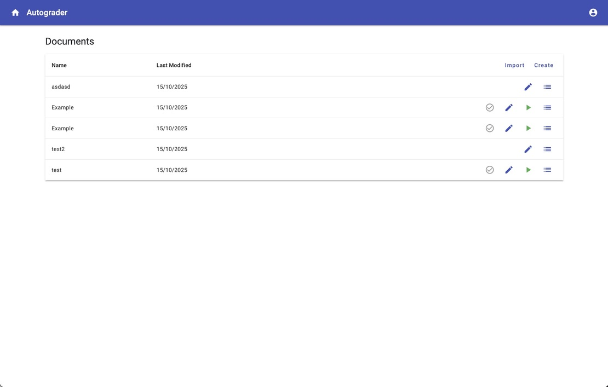
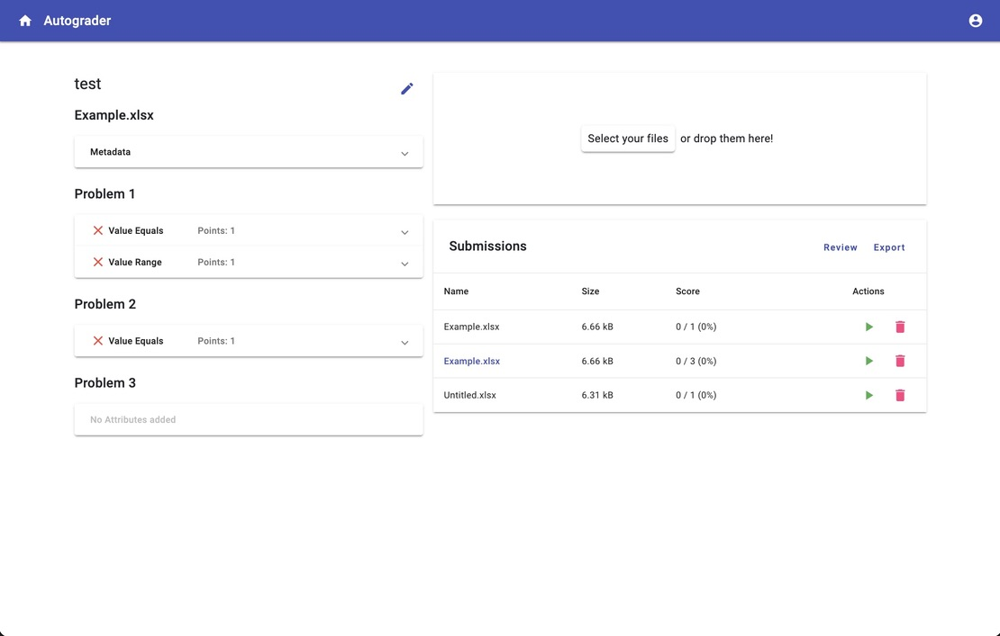
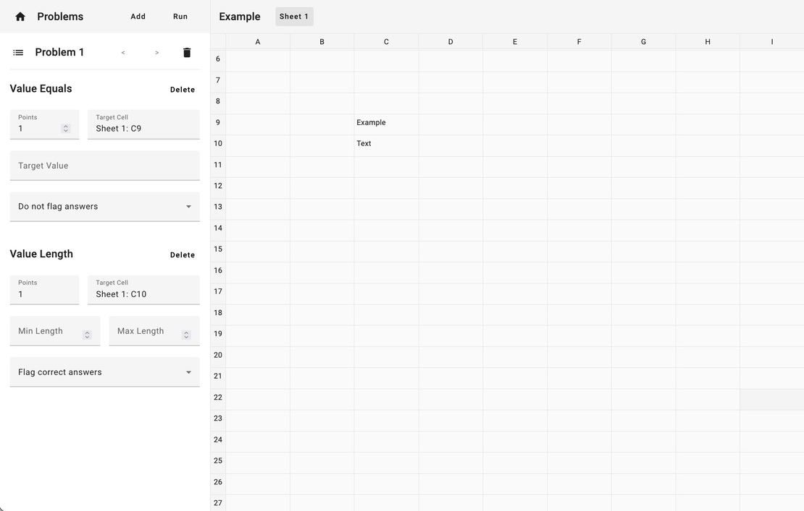

# Excel Autograder

[](https://github.com/kaminskia1/excel-autograder/)
[](https://opensource.org/licenses/MIT)

A lightweight, web-based auto-grader for Excel-based classroom assignments. Create grading rubrics visually, upload student submissions in bulk, and export detailed grade reports—all from your browser.

🌐 **[Live Demo](https://excel.kaminski.pw/)**

## ✨ Features

### For Educators
- **Visual Rubric Builder** — Click on spreadsheet cells to define grading criteria without writing code
- **Custom Problem Names** — Name your problems descriptively instead of generic "Problem 1, 2, 3..."
- **Bulk Grading** — Upload multiple student submissions at once and grade them instantly
- **Detailed Reports** — Export grades to Excel with scores, metadata, and per-criterion breakdowns
- **Assignment Import/Export** — Share rubrics between instructors or back them up as portable strings

### Grading Criteria (Facets)
| Type | Description |
|------|-------------|
| **Value Equals** | Check if a cell's computed value matches an expected value |
| **Value Range** | Verify a cell's value falls within a specified range (great for rounding tolerance) |
| **Value Length** | Validate the length of cell content |
| **Formula Contains** | Ensure a cell's formula includes specific text or functions |
| **Formula List** | Check that referenced cells use required formulas |
| **Formula Regex** | Match formulas against regular expression patterns |

### Technical Highlights
- 📊 In-browser Excel rendering with full formula support
- 🔐 Token-based authentication with user isolation
- 📁 Secure file handling with extension validation
- 🐳 Fully containerized with Docker Compose

## 🛠 Tech Stack

| Layer | Technology |
|-------|------------|
| **Frontend** | Angular 17, Angular Material, TypeScript |
| **Backend** | Django 4.2, Django REST Framework |
| **Database** | PostgreSQL |
| **Excel Processing** | ExcelJS (client-side parsing & rendering) |
| **Containerization** | Docker, Docker Compose |

## 📸 Screenshots

<details>
<summary>Click to view screenshots</summary>

### Dashboard


### Rubric Editor (Wizard)


### Grading View


</details>

## 🚀 Getting Started

### Prerequisites
- [Docker](https://docs.docker.com/get-docker/) & [Docker Compose](https://docs.docker.com/compose/install/)

### Quick Start with Docker

1. **Clone the repository**
   ```bash
   git clone https://github.com/kaminskia1/excel-autograder.git
   cd excel-autograder
   ```

2. **Create environment file**
   ```bash
   touch .env
   ```

3. **Start the services**
   ```bash
   docker-compose up -d
   ```

4. **Run database migrations**
   ```bash
   docker exec -it django python manage.py migrate
   ```

5. **Create a superuser**
   ```bash
   docker exec -it django python manage.py createsuperuser
   ```

6. **Access the application**
   - Frontend: http://localhost
   - Backend API: http://localhost:8000/api/v1/
   - Admin Panel: http://localhost:8000/admin/

### Local Development (Without Docker)

<details>
<summary>Backend Setup</summary>

```bash
# Create virtual environment
python -m venv venv
source venv/bin/activate  # On Windows: venv\Scripts\activate

# Install dependencies
pip install -r requirements.txt

# Configure database in core/settings.py (update HOST to 'localhost')

# Run migrations
python manage.py migrate

# Create superuser
python manage.py createsuperuser

# Start server
python manage.py runserver
```

</details>

<details>
<summary>Frontend Setup</summary>

```bash
cd public

# Install dependencies
npm install --legacy-peer-deps

# Start development server
npm start
```

The frontend will be available at http://localhost:4200

</details>

## 📖 Usage Guide

### Creating an Assignment

1. **Log in** to your account
2. Click **Create** on the dashboard
3. Enter an assignment name and upload your master Excel file (the answer key)
4. Click **Edit** to open the Rubric Editor

### Building a Rubric

1. In the Rubric Editor, click **Add** to create a new problem
2. Click on the problem name to give it a custom name (optional)
3. Click on any cell in the spreadsheet preview
4. Select a grading criterion type from the dropdown:
   - **Value Equals** — For exact value matching
   - **Value Range** — For numerical tolerance
   - **Formula Contains** — To check for specific functions
5. Configure the criterion (points, expected values, etc.)
6. Repeat for all cells you want to grade
7. Changes save automatically

### Grading Submissions

1. From the dashboard, click the **Play** button on your assignment
2. Drag & drop student `.xlsx` files or click to browse
3. View instant scores and detailed breakdowns
4. Click **Export** to download a grade report spreadsheet

## 🗂 Project Structure

```
excel-autograder/
├── core/                   # Django project settings
├── assignments/            # Assignment model & API
├── users/                  # User authentication
├── public/                 # Angular frontend
│   └── src/app/
│       ├── components/     # Shared UI components
│       ├── models/         # Data models & services
│       │   ├── assignment/ # Assignment logic
│       │   ├── question/   # Question & Facet system
│       │   ├── submission/ # Submission handling
│       │   └── workbook/   # Excel workbook utilities
│       ├── services/       # API service layer
│       └── views/          # Page components
│           ├── dashboard/  # Assignment list
│           ├── wizard/     # Rubric editor
│           ├── grader/     # Submission grading
│           └── auth/       # Login & registration
├── docs/                   # Documentation & images
├── docker-compose.yaml     # Container orchestration
├── Dockerfile              # Django container
└── requirements.txt        # Python dependencies
```

## 🔌 API Endpoints

| Method | Endpoint | Description |
|--------|----------|-------------|
| `POST` | `/api/v1/auth/login/` | Authenticate user |
| `POST` | `/api/v1/auth/register/` | Create new account |
| `POST` | `/api/v1/auth/logout/` | End session |
| `GET` | `/api/v1/assignments/` | List user's assignments |
| `POST` | `/api/v1/assignments/` | Create assignment |
| `GET` | `/api/v1/assignments/:id/` | Get assignment details |
| `PUT` | `/api/v1/assignments/:id/` | Update assignment |
| `DELETE` | `/api/v1/assignments/:id/` | Delete assignment |

All endpoints except registration require token authentication via `Authorization: Token <token>` header.

## 🤝 Contributing

Contributions are welcome! Please feel free to submit a Pull Request.

1. Fork the repository
2. Create your feature branch (`git checkout -b feature/AmazingFeature`)
3. Commit your changes (`git commit -m 'Add some AmazingFeature'`)
4. Push to the branch (`git push origin feature/AmazingFeature`)
5. Open a Pull Request

## 📄 License

This project is licensed under the MIT License - see the [LICENSE](LICENSE) file for details.

## 🙏 Acknowledgments

- [ExcelJS](https://github.com/exceljs/exceljs) for client-side Excel parsing
- [Angular Material](https://material.angular.io/) for UI components
- [Django REST Framework](https://www.django-rest-framework.org/) for the API layer
